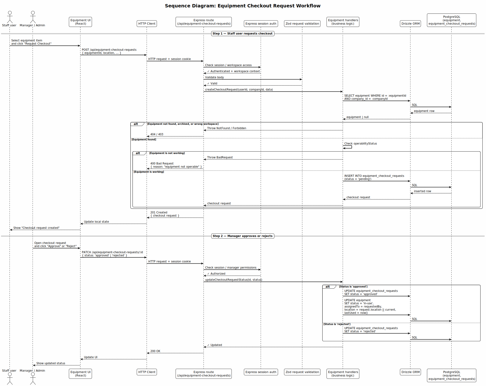

# StreamDesk Architecture

StreamDesk is a workspace platform for event and production teams. It brings together a task manager (Kanban), a calendar, an equipment warehouse, and an admin dashboard into a single interface, with multi-tenant isolation between companies.

This document is the canonical index for the maintained architecture of StreamDesk. It describes the current delivered architecture and links the supporting architecture artifacts.

## Architecture Overview

StreamDesk is built as a **monorepo** with three logical layers:

1. **Client layer** — a React + TypeScript single-page application.
2. **Server layer** — a Node.js + Express REST API and WebSocket gateway.
3. **Data layer** — a PostgreSQL database accessed through Drizzle ORM.

A `shared/` directory contains TypeScript types and Zod validation schemas used by both the client and the server. Our team focuses on the architecture and implementation of the **Task Manager (Kanban)**, **Calendar**, **Equipment (Warehouse)**, and **Admin Panel** modules.

## Architecture Views

### Static View

The static view shows the main components of the system, the external systems it interacts with, and the communication paths between them.

*Source: [`static-view/component-diagram.puml`](./static-view/component-diagram.puml)*

The diagram shows three internal layers (Client, Server, Data) and the external integrations (YouGile, browser clients). 

**Key architectural boundaries:**
- **Authentication boundary:** Handled via `express-session` and a custom middleware that populates `req.user` from `req.session.userId`.
- **Realtime boundary:** The server exposes a `/ws` WebSocket endpoint used for realtime updates and React Query invalidation for systems, streams, tasks, calendar events, and integration stats.
- **Equipment module:** The Equipment module is stable, but its current primary state-changing workflow is **checkout requests and approve/reject handling**. The older `equipment_reservations` route still exists as legacy, but it is not the main warehouse workflow.

**Coupling and cohesion:**
- **Coupling between layers is low.** The client talks to the server only through REST over HTTP/JSON and WebSocket. 
- **Cohesion of domain modules is high.** Critical access-control logic (like equipment permissions) is isolated into dedicated, pure modules on the client side rather than scattered across UI components.

**Maintainability implications:**
- Centralizing business rules (e.g., permission evaluators) makes the system easier to reason about and modify without introducing regressions in unrelated modules.
- The monolithic `routes.ts` file on the server remains a maintainability risk, as server-side authorization checks are currently route-local rather than centralized.

### Dynamic View

The dynamic view shows how components interact over time for non-trivial workflows. We maintain sequence diagrams for the most critical scenarios across our core modules.

#### Equipment Checkout Workflow

*Source: [`dynamic-view/equipment-checkout-sequence.puml`](./dynamic-view/equipment-checkout-sequence.puml)*

**Scenario:** A staff user requests equipment checkout from the warehouse, and a manager approves or rejects it.
**Why it matters:** This is the current primary state-changing workflow for the Equipment module. It illustrates how the system enforces business rules (workspace access, equipment operability) and manages state transitions (pending -> approved/rejected) without relying on date-range availability checks.

#### Kanban Card Creation

*Source: [`dynamic-view/kanban-card-creation-sequence.puml`](./dynamic-view/kanban-card-creation-sequence.puml)*

**Scenario:** A user creates a new card in a Kanban board.
**Why it matters:** This scenario demonstrates the strict server-side validation and permission checks required for task management. It shows how the system verifies board access, list membership, resolves assignees and labels, creates history entries, and optionally triggers notifications, all before emitting a realtime update via the WebSocket gateway.

#### Calendar Event Creation

*Source: [`dynamic-view/calendar-event-creation-sequence.puml`](./dynamic-view/calendar-event-creation-sequence.puml)*

**Scenario:** A user creates a calendar event and invites participants.
**Why it matters:** This scenario highlights a deliberate architectural choice regarding fault tolerance. The event is persisted first. Participant invitation rows and notifications are created afterwards. This approach is tolerant to individual participant/notification failures (which are logged but do not rollback the created event), prioritizing the creation of the core event over the atomicity of all side-effects.

### Deployment View

The deployment view shows where the system runs and how users reach it.

*Source: [`deployment-view/deployment-diagram.puml`](./deployment-view/deployment-diagram.puml)*

**What the diagram shows:**
- A single VPS running Nginx, a Node.js process managed by PM2, and a local PostgreSQL instance.
- **Nginx** terminates TLS and routes browser traffic to the StreamDesk runtime. It proxies both REST API (`/api/*`) and WebSocket (`/ws`) traffic to the Node.js process. Depending on server configuration, static assets may be served directly by Nginx or by the Express production static handler from `dist/public`.
- **Node.js process** hosts the REST API, the WebSocket gateway, and background jobs (e.g., YouGile sync) in the same process.
- **PostgreSQL** uses Drizzle schema definitions combined with runtime schema guards (`ALTER TABLE ADD COLUMN IF NOT EXISTS`) rather than a strict migration workflow.

**Why this deployment model was chosen:**
- For the current stage of the product (MVP v2, small user base, small team), a single VPS is the simplest model that satisfies availability and cost constraints.
- PM2 provides process supervision (automatic restart on crash) without introducing a container orchestrator.

**How it supports or constrains the product:**
- **Supports Availability:** PM2 restarts the process on crash.
- **Constrains Scalability and Fault Tolerance:** The VPS is a single point of failure, and horizontal scaling would require reworking the deployment and session handling.

## Architecture Decision Records

The following ADRs document the most important architectural decisions made for the core features developed by our team. Each ADR is linked to the quality requirements it addresses.

- [ADR-001: Centralized Equipment Permission Evaluator](./adr/ADR-001-centralized-equipment-permissions.md)
- [ADR-002: Declarative Protected Route Wrapper](./adr/ADR-002-declarative-protected-route-wrapper.md)
- [ADR-003: Unified Monorepo Test and Coverage Configuration](./adr/ADR-003-unified-monorepo-coverage.md)

### How the decisions fit together

These three decisions form the foundation of our team's approach to **security, functional correctness, and maintainability**:

1. **Functional Correctness & Security (QR-01, QR-02):** 
   - **ADR-001** ensures that complex business rules for equipment access are evaluated consistently on the client side, while server-side route-local checks enforce authorization at the API boundary. 
   - **ADR-002** complements this at the UI/routing layer by declaratively protecting pages, ensuring that users cannot access restricted areas without proper authentication and tab-level permissions.
   - Together, they create a defense-in-depth approach: the UI prevents unauthorized navigation, and the server enforces permissions before modifying data.

2. **Maintainability & Testability (QR-03):**
   - **ADR-003** ensures that the entire monorepo (client, server, and shared logic) is covered by a unified automated testing and coverage pipeline. 
   - Because the permission logic (ADR-001) and the routing guards (ADR-002) are isolated and pure, they are highly testable. ADR-003 guarantees that this testability is enforced automatically in CI, providing repeatable evidence that critical access-control behavior remains correct over time.