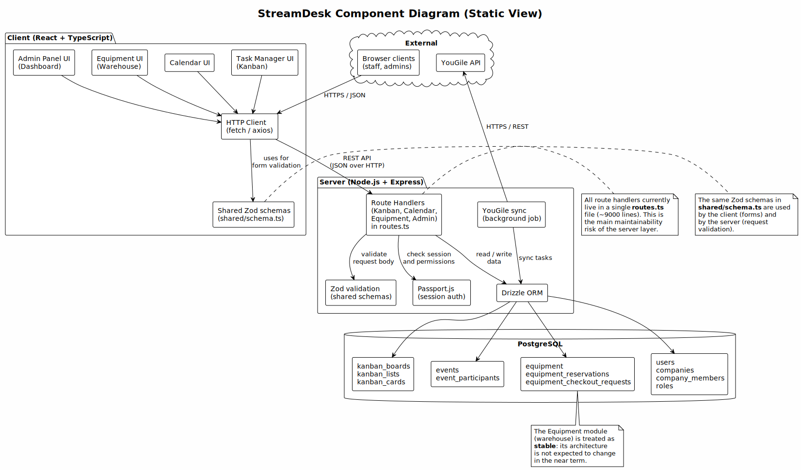
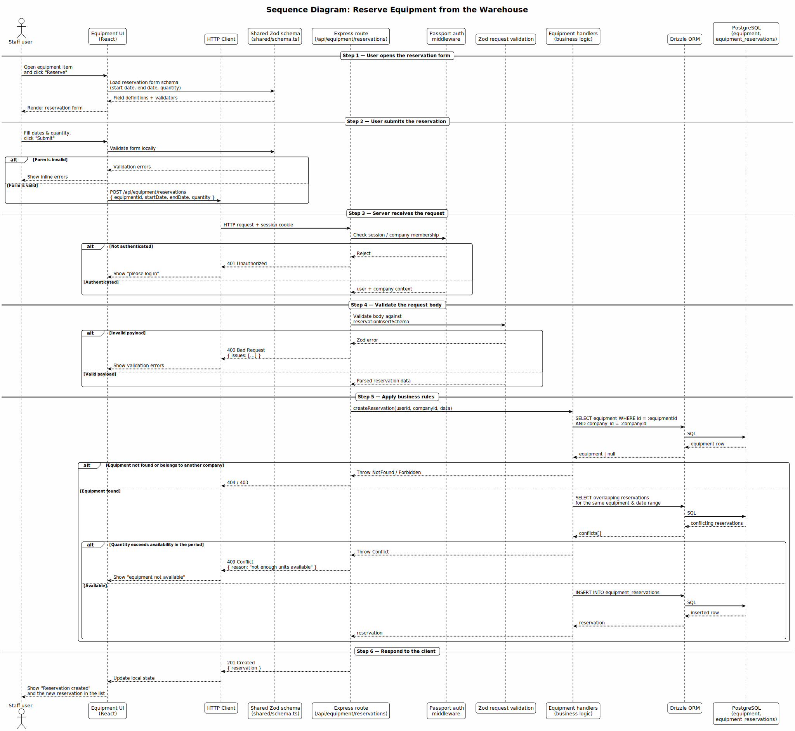
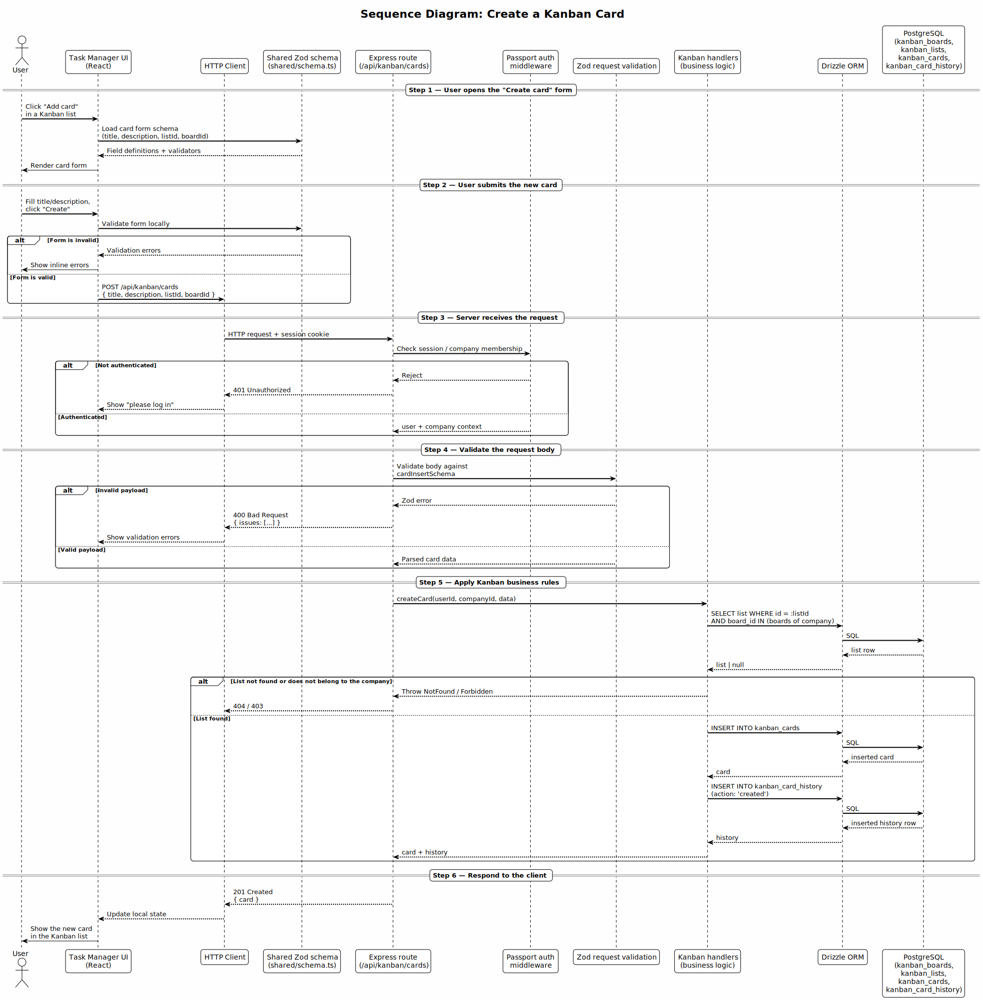
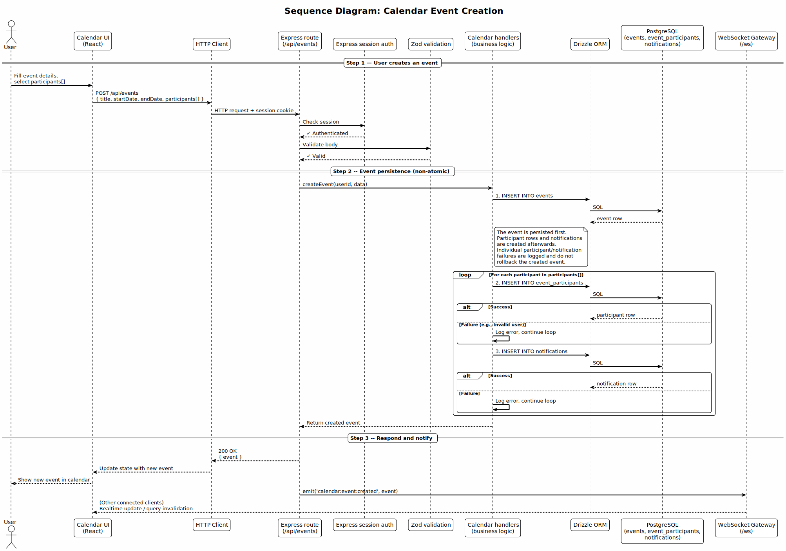
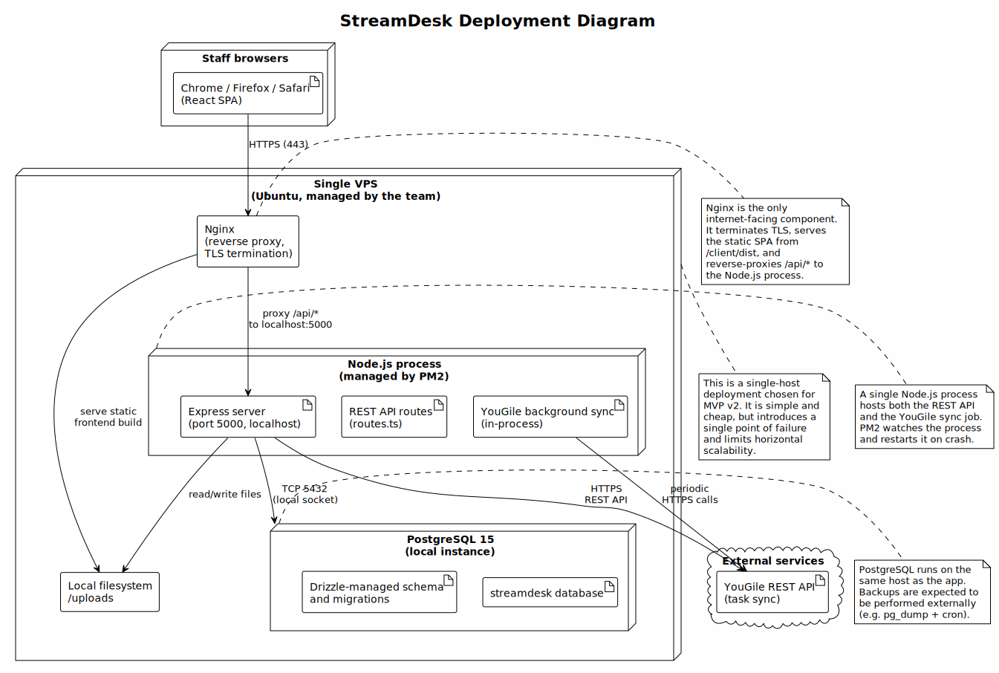

# StreamDesk Architecture

StreamDesk is a workspace platform for event and production teams, combining a Task Manager (Kanban), a Calendar, an Equipment warehouse, and an Admin dashboard, with multi-tenant isolation between companies.

This document is the canonical maintained architecture index. It describes the current delivered architecture and links the supporting architecture artifacts.

## Architecture Views

The maintained architecture is organized into three view directories:

- Static view: [`docs/architecture/static-view/`](./static-view/)
- Dynamic view: [`docs/architecture/dynamic-view/`](./dynamic-view/)
- Deployment view: [`docs/architecture/deployment-view/`](./deployment-view/)

Each view directory contains PlantUML source files (`.puml`) and rendered SVG diagrams. The rendered SVGs are embedded below for readability; the source files are the maintained artifacts.

## Static View

The static view shows the main internal components, external systems, and communication paths of StreamDesk.

*Source: [`component-diagram.puml`](./static-view/component-diagram.puml)*

**What the diagram shows**

The diagram shows three internal layers (Client, Server, Data) and the external YouGile integration. The Server layer exposes a single "Route Handlers" component that encapsulates all domain handlers (Kanban, Calendar, Equipment, Admin) behind a shared validation and authentication boundary. All database access goes through a single Drizzle ORM component, which hides the per-table details from the handlers.

**Coupling**

- **Between layers**: low — the client talks to the server only through REST/JSON, and the server talks to the database only through Drizzle ORM.
- **Inside the server**: high — almost all route handlers and business logic live in a single `routes.ts` file (~9000 lines).

**Cohesion**

- **Equipment module**: high — its handlers, schema, and reservations form a self-contained, stable unit.
- **Kanban and Calendar modules**: moderate — they share more state and cross-cut handlers than Equipment.
- **Server as a whole**: low — the monolithic `routes.ts` mixes unrelated domains in one file.

**Maintainability implications**

- Extending the stable Equipment module is straightforward because its area inside `routes.ts` is already self-contained in practice.
- Adding cross-cutting server features (new permissions, new notification types) requires touching `routes.ts` in many places, which increases regression risk.
- Unit testing of server business logic is hard because handlers are tightly coupled to request/response objects and database calls.

**Quality requirements supported or constrained**

- The layered client/server/data structure supports **Interoperability** and layer-level **Modifiability**.
- The monolithic `routes.ts` constrains server-level **Modifiability** and **Testability**.
- The shared `shared/schema.ts` between client and server supports **Interoperability** by giving both sides a single source of truth for types.

## Dynamic View

The dynamic view shows how components interact over time for non-trivial workflows.

### Equipment reservation

*Source: [`equipment-reservation-sequence.puml`](./dynamic-view/equipment-reservation-sequence.puml)*

**What the diagram shows**

The diagram shows the full flow of a staff user reserving a piece of equipment: client-side form validation with shared Zod schemas, REST request to the server, authentication, Zod request validation, business rules (availability and date conflicts), database write through Drizzle ORM, and structured response back to the UI.

**Scenario represented**

A staff user reserves equipment from the warehouse for a date range.

**Why this scenario is important**

The Equipment warehouse is one of the stable core features of StreamDesk, and reservation is its primary state-changing workflow. This scenario exercises all main architectural boundaries (client → server → database) and shows how the system enforces business rules before persisting anything.

**What it helps reason about**

- The **integration boundary** between client and server: all state changes go through REST, the client never touches the database directly.
- The **validation boundary**: input is validated with Zod before any business logic runs.
- **Security**: invalid or unauthorized reservation requests are rejected before any database write.
- **Fault tolerance**: if the database write fails, the API returns a structured error and the UI can react without corrupting state.

### Kanban card creation

*Source: [`kanban-card-creation-sequence.puml`](./dynamic-view/kanban-card-creation-sequence.puml)*

**What the diagram shows**

The diagram shows the flow of a user creating a new Kanban card in a list: client-side form validation, REST POST to `/api/kanban/cards`, authentication, Zod validation, business logic that creates the card and records history, database write through Drizzle ORM, and response back to the UI.

**Scenario represented**

A user creates a new task card in a Kanban list.

**Why this scenario is important**

The Task Manager is one of the main features your team owns, and card creation is its most frequent write operation. This scenario shows how Kanban-specific business rules (board/list membership, history tracking) are enforced on top of the same shared validation and persistence stack used by other modules.

**What it helps reason about**

- The **shared validation boundary**: Kanban uses the same Zod + `shared/schema.ts` mechanism as Equipment and Calendar.
- The **history boundary**: every card mutation is recorded in `kanban_card_history`, which is important for auditability and later "what changed" features.
- **Modifiability**: adding a new card field requires touching `shared/schema.ts`, the Drizzle table, and the Kanban handlers in `routes.ts`, but no other module.
- **Testability**: the same integration-test approach used for Equipment applies here.

### Calendar event creation

*Source: [`calendar-event-creation-sequence.puml`](./dynamic-view/calendar-event-creation-sequence.puml)*

**What the diagram shows**

The diagram shows the flow of a user creating a calendar event: client-side form validation, REST POST to `/api/calendar/events`, authentication, Zod validation, business logic that creates the event and participant rows in a single transaction, database write through Drizzle ORM, and response back to the UI.

**Scenario represented**

A user creates a calendar event and invites participants.

**Why this scenario is important**

The Calendar is the second feature your team owns, and event creation is its main write workflow. This scenario shows how the Calendar module coordinates two related tables (`events` and `event_participants`) inside a single transaction, which is a different shape from the single-row writes in Equipment and Kanban.

**What it helps reason about**

- The **transaction boundary**: event + participants are created atomically, so a failure does not leave orphan participants.
- The **shared validation boundary**: Calendar uses the same Zod + `shared/schema.ts` mechanism as the other modules.
- **Fault tolerance**: if the transaction fails, no partial event is visible to other users.
- **Modifiability**: adding a new event field or a new participant attribute follows the same pattern as in Equipment and Kanban.

## Deployment View

The deployment view shows where the system runs and how users reach it.

*Source: [`deployment-diagram.puml`](./deployment-view/deployment-diagram.puml)*

**What the diagram shows**

The diagram shows a single VPS running Nginx, a Node.js process managed by PM2, and a local PostgreSQL instance. Nginx terminates TLS, serves the static frontend build, and reverse-proxies `/api/*` to the Node.js process. The Node.js process hosts the Express REST API and the YouGile sync job in the same process. Staff browsers reach the product over HTTPS through Nginx.

**Why this deployment model was chosen**

- For MVP v2 with a small user base and a small team, a single VPS is the simplest model that satisfies availability and cost constraints.
- PM2 provides process supervision (automatic restart on crash) without introducing a container orchestrator.
- Keeping the database on the same host removes a network hop and simplifies backups.

**How it supports or constrains the product**

- **Supports Availability**: PM2 restarts the process on crash, and Nginx serves the frontend even if the API is briefly unavailable.
- **Supports Deployability**: a single `git push` plus `pm2 restart` is enough to deploy a new version.
- **Constrains Scalability and Fault tolerance**: the VPS is a single point of failure, and horizontal scaling would require reworking the deployment and session handling.
- **Constrains Operability**: there is no automated backup or monitoring beyond what PM2 and Nginx provide out of the box.

**What must be considered when operating it**

- Regular PostgreSQL backups (e.g. `pg_dump` via cron) with off-host storage.
- Log rotation for both Nginx and PM2.
- TLS certificate renewal (e.g. via Let's Encrypt / Certbot).
- A plan for migrating to a managed database and/or containerized deployment before the user base outgrows a single VPS.

## Architecture Decision Records

The following ADRs document the most important architectural decisions made for the core features developed by our team (Equipment, Admin Panel, Access Control, and Testing infrastructure). Each ADR is linked to the quality requirements it addresses.

- [ADR-001: Centralized Equipment Permission Evaluator](./adr/ADR-001-centralized-equipment-permissions.md)
- [ADR-002: Declarative Protected Route Wrapper](./adr/ADR-002-declarative-protected-route-wrapper.md)
- [ADR-003: Unified Monorepo Test and Coverage Configuration](./adr/ADR-003-unified-monorepo-coverage.md)

### How the decisions fit together

These three decisions form the foundation of our team's approach to **security, functional correctness, and maintainability** for the Equipment, Admin, and shared modules:

1. **Functional Correctness & Security (QR-01, QR-02):** 
   - **ADR-001** ensures that complex business rules for equipment access (create, edit, reserve) are evaluated consistently and correctly by centralizing the logic. 
   - **ADR-002** complements this at the UI/routing layer by declaratively protecting pages, ensuring that users cannot access restricted areas without proper authentication and permissions.
   - Together, they create a defense-in-depth approach: the UI prevents unauthorized navigation (ADR-002), and the centralized evaluator guarantees that the underlying business logic and API endpoints enforce the correct permissions (ADR-001).

2. **Maintainability & Testability (QR-03):**
   - **ADR-003** ensures that the entire monorepo (client, server, and shared logic like the permission evaluator from ADR-001) is covered by a unified automated testing and coverage pipeline. 
   - Because the permission logic (ADR-001) and the routing guards (ADR-002) are isolated and pure, they are highly testable. ADR-003 guarantees that this testability is enforced automatically in CI, providing repeatable evidence that critical access-control behavior remains correct over time.

All three decisions directly support the team's Quality Requirements by isolating critical logic, making it testable, and enforcing that testability through automated CI gates.