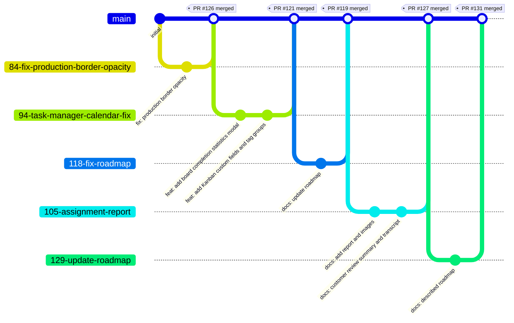

# Development Process

This document describes the real development workflow used by **StreamDesk (Team 34)**.
It covers how we manage the Product and Sprint Backlogs, our git branching model, code review practices, configuration and secrets handling, and the development environment setup.

---

## 1. Backlog and Board Management

### 1.1 Boards

We use **GitHub Projects** to visualise and manage work.

| Board | Purpose | Link |
|-------|---------|------|
| **Product Backlog** | Single source of all potential work (PBIs) ordered by priority | [Project 1](https://github.com/orgs/swp-team-34/projects/1) |
| **Sprint Backlog** | Subset of PBIs selected for the current Sprint, tracked in an active Kanban view | [Project 2](https://github.com/orgs/swp-team-34/projects/2) |

The Sprint Backlog is the **authoritative container** for the current Sprint. Only issues assigned to the current Sprint milestone appear on this board.

### 1.2 Workflow States and Entry Criteria

Every issue on the Sprint Backlog moves through the following states.
The table below defines the **entry criteria** that must be satisfied before an issue can be placed in a given column.

| State / Column | Entry Criteria |
|----------------|----------------|
| **Backlog** | Issue has been created using one of the defined templates, has a clear description, and is ready for refinement. No estimation or assignment is required yet. |
| **Selected for Sprint** | Issue has a clear expected outcome, acceptance criteria, an estimate (Story Points), an assignee (implementer), and a different reviewer listed in the description. It is assigned to the current Sprint milestone and appears on the Sprint Backlog board. |
| **In Progress** | A feature branch named `<issue-number>-short-description` has been created from `main`. The implementer has started working on the issue. |
| **In Review** | A Pull Request has been opened from the feature branch into `main`. The PR description follows the team template, includes a link to the issue (`Closes #N`), and all CI checks (linting, tests, coverage, audit, link checker) have passed. At least one other team member is assigned as reviewer. |
| **Done** | The PR has been approved by the reviewer, all discussions are resolved, and the branch has been merged into `main` with a merge commit. The acceptance criteria have been verified, the changelog updated (if the change is user-visible), and the issue is closed. |

---

## 2. Git Workflow

We adapted **GitHub Flow** with a few course‑specific rules.

### 2.1 Issue Creation

- All work starts with an **Issue**.
- We use four issue templates:
  - **User Story** – for end‑user functionality (`As a … I want … so that …`).
  - **Bug Report** – for defects (expected vs actual behaviour, steps to reproduce).
  - **Other PBI** – for technical tasks, infrastructure, documentation, etc.
  - **Course Task** – for course‑specific assignments.
- Templates are stored in `.github/ISSUE_TEMPLATE/` and are selected when clicking **New Issue**.

### 2.2 Labeling and Assignment

- **Type labels** are set automatically by the chosen issue template:
  - `bug` for Bug Report
  - `course-task` for Course Task
  - `pbi` for Other PBI
  - `user-story` for User Story
- **Work Status** is tracked via the dropdown in each issue body (custom field). The values used are:
  - `To Do`
  - `Ready`
  - `In Progress`
  - `Review`
  - `Done`
- **MoSCoW priority** is recorded in the dedicated dropdown field (values: `Must`, `Should`, `Could`, `Won't for this release`, or `Not applicable` depending on issue type).
- **Story Points** are set in the `Story Points` field when the issue is estimated (User Stories and applicable PBIs).
- **MVP version** is filled in the `MVP version` field where relevant (e.g., `MVP v1`, `MVP v2`, `Not applicable`).
- The **implementer** is assigned through the GitHub `Assignee` field (right sidebar) and also listed in the `Implementer` field inside the issue body.
- A **different reviewer** is written in the `Reviewer` field inside the issue body (e.g., `@username`). This field is required in every template to ensure review responsibility is documented from the start.
- The **Sprint milestone** is attached to the issue via the GitHub `Milestone` selector when the item is selected for a Sprint.

### 2.3 Branch Naming

Branches are created from `main` **must** follow the pattern: <issue-number>-short-description

Examples:
- `42-add-calendar-view`
- `55-fix-localisation-bug`
- `68-course-task-assignment-report`

### 2.4 Commit Messages

We do not enforce a strict conventional commit standard, but we aim for meaningful English messages. The following prefixes are encouraged:
- `feat:` – new feature
- `fix:` – bug fix
- `docs:` – documentation
- `chore:` – maintenance or tooling
- `test:` – adding or updating tests

### 2.5 Pull Requests

1. Push the feature branch to GitHub.
2. Open a Pull Request **from** the feature branch **into** `main`.
3. Use the **Pull Request template** (`.github/pull_request_template.md`).
   The template includes the following sections that must be filled:
   * **Linked issue** – reference the issue (e.g., `Closes #42`).
   * **Summary** – describe the change.
   * **Branch naming confirmation** – verify the branch follows `<issue-number>-short-description`.
   * **Linked issue type** – select the correct type: User Story, Other PBI, Course Task, or Bug Report.
   * **Expected linked issue Work Status after merge** – choose the appropriate status (usually `Done` for completed work).
   * **MoSCoW priority** – fill in if the issue has a priority, otherwise `Not applicable`.
   * **Story Points** – fill in or mark `Not applicable`.
   * **MVP version** – fill in or mark `Not applicable`.
   * **Sprint role confirmation** – document the implementer and reviewer, and confirm they are different people.
   * **Acceptance criteria verification** – confirm that all acceptance criteria are listed in the linked issue and have been verified; explain any incomplete criterion.
   * **Testing/verification evidence** – provide commands run, results, and links to evidence files.
   * **Screenshots or demo evidence** – link evidence or write `Not applicable`.
   * **Changelog** – select exactly one option: update `CHANGELOG.md` for user-visible changes, or mark as not applicable.
   * **Quality checklist** – check that scope matches the issue, documentation is updated, tests were run, no secrets are committed, and links were checked.
   * **Reviewer checklist** – the reviewer must confirm the PR is properly linked, the branch name follows conventions, acceptance criteria are clear and verified, evidence is sufficient, Definition of Done is satisfied, changelog selection is correct, a meaningful review was left (or approval explains no changes needed), and workflow evidence is preserved.
   * **Merge readiness** – confirm required reviews are complete, checks pass, merge commit will be used, and the branch can be deleted after merge.
   * **Related assignment section** – list the relevant assignment part(s) or `Not applicable`.

4. Ensure the CI pipeline (`.github/workflows/quality.yml`) passes for the PR branch.
5. Request a review from the designated reviewer (different from the implementer). The reviewer must check the items in the **Reviewer checklist** and either approve or request changes.
6. Once approved and all CI checks are green, the implementer merges the PR using a **merge commit** (see section 2.7).

### 2.6 Code Review

- A reviewer (different from the implementer) must **approve** the PR before merging.
- The reviewer uses the **Reviewer checklist** from the Pull Request template and verifies that:
  - The PR is correctly linked to an issue.
  - The issue type matches the work.
  - The branch name follows the `<issue-number>-short-description` convention.
  - Acceptance criteria are clear and have been verified.
  - Evidence (tests, screenshots, commands) is sufficient for the change.
  - The team Definition of Done is satisfied if the PR completes the linked issue.
  - Exactly one changelog option is selected and the decision is reasonable.
  - No secrets, tokens, passwords, `.env` files, private recordings, confidential materials, or unnecessary PII are committed.
  - Links were checked or intentionally excluded with justification.
  - Repository workflow evidence is preserved; historical evidence was not deleted or rewritten.
- The reviewer leaves a meaningful review comment if feedback is needed, or explains in the approval that no changes were required.
- All review comments must be resolved before merging.

### 2.7 Merging and Closing Issues

- We use **merge commits** (no squash, no rebase) to preserve full history.
- Before merging, the **Merge readiness** checklist from the PR template must be confirmed:
  - Required reviews are complete.
  - All required CI checks have passed.
  - The merge commit strategy is selected.
  - The branch can be deleted after merge.
- After merge, the branch is **deleted** (GitHub can do this automatically when the PR is merged).
- The linked issue is automatically closed if the PR description contained `Closes #N`. Otherwise, it is closed manually after verifying that all acceptance criteria and the Definition of Done are satisfied.
- The **Work Status** of the linked issue is moved to `Done` (if not already updated by automation) to reflect the completion.

### 2.8 Main Branch Protection

- Direct pushes to `main` are **forbidden**.
- All changes must arrive through a reviewed, CI‑passing Pull Request.
- Branch protection rules enforce:
  - Require a pull request before merging.
  - Require at least one approving review.

---

## 3. Gitgraph Diagram

The following **Mermaid** diagram shows our real branching and merging flow (based on recent commits).




## 4. Configuration and Secrets Management

### 4.1 Secrets
- **All secrets** (database URLs, API keys, session secrets, tokens) are stored **only** in environment variables.
- The local environment file `.env` is **never committed** – it is listed in `.gitignore`.
- A sanitised example file **`.env.example`** is committed to show required variables without real values.

### 4.2 Ignored Files

Key files and directories excluded from version control (see the complete list in `.gitignore` at the repository root):

- **Environment:** `.env` and all local environment variants (`.env.*.local`, `.env.production`, `.env.development`).
- **Dependencies:** `node_modules/`, `.pnp`, `.yarn/`.
- **Build output:** `dist/`, `build/`, `*.tsbuildinfo`, `.next/`.
- **Logs:** `*.log`, `logs/`.
- **User uploads:** `uploads/` (except `.gitkeep` marker files), `attached_assets/`.
- **Database files:** `*.db`, `*.sqlite`, `*.sqlite3`, `*.db-journal`, `*.db-shm`, `*.db-wal` (the schema file `create_connection_schemas_tables.sql` is tracked).
- **SSL certificates and private keys:** `*.pem`, `*.key`, `*.crt`, `*.cert`, `*.csr`, `*.p12`, `*.pfx`, `ssl/`, `certs/`, `private/`.
- **IDE and editor files:** `.vscode/` (with limited exceptions for shared settings), `.idea/`, `*.swp`, `*.swo`, `*~`.
- **Test and coverage artifacts:** `coverage/`, `.nyc_output/`, `.jest/`, `test-results/`.
- **Deployment and local configuration:** `deploy.config`, `ecosystem.config.js.bak`, `pm2.log`, `.pm2/`.
- **Backups and archives:** `*.bak`, `*.backup`, `*.old`, `backup/`, `*.tar.gz`, `*.zip`, `*.rar`.
- **OS and temporary files:** `.DS_Store`, `Thumbs.db`, `desktop.ini`, `*.tmp`, `.cache/`, `temp/`, `tmp/`.

### 4.3 Runtime Configuration
- The application reads all settings from **environment variables** using `process.env` (see `server/index.ts`).
- The first line of the server entry point imports `dotenv/config`, which loads a `.env` file into `process.env` during local development.
- Required variables (e.g., `PORT`, `DATABASE_URL`, `SESSION_SECRET`) are documented in the committed file `.env.example`.
- In production, these variables are injected directly into the server environment (e.g., via PM2 settings) and no `.env` file is stored in the repository or on the server.

### 4.4 CI Configuration

Our CI consists of two automated GitHub Actions workflows:

**1. Quality workflow** (`.github/workflows/quality.yml`)
- Triggers:
  - on push to the `main` branch (and selected long-lived feature branches like `81-configure-assignment-4-quality-tests-ci`),
  - on every pull request,
  - manual trigger via `workflow_dispatch`.
- Steps:
  - `npm ci` – clean install dependencies
  - `npm run check` – TypeScript type checking
  - `npm test` – unit and integration tests
  - `npm run coverage` – test coverage report
  - `npm run build` – production build
  - `npm audit --audit-level=critical` – critical vulnerability check

**2. Link Check workflow** (`.github/workflows/lychee.yml`)
- Triggers:
  - on push to `main`,
  - on every pull request,
  - manual trigger via `workflow_dispatch`.
- Steps:
  - Runs [lychee](https://lychee.cli.rs/) with the project’s configuration file (`lychee.toml`) to validate all hyperlinks in Markdown and other supported files.

- **No continuous deployment (CD)** is used yet; deployment is triggered manually.

### 4.5 Deployment Configuration

- Production build is created with `npm run build`, which compiles both the frontend and backend into the `dist/` directory.
- The compiled server (`dist/index.js`) runs on the production host using **PM2**, a process manager configured via `ecosystem.config.cjs`.
- Deployment to the remote server is **triggered manually** by running helper scripts:
  - `deploy.mjs` (Linux/macOS) or `deploy-server.bat` (Windows) – builds the project, synchronizes files to the server, and invokes `deploy-to-server.sh` remotely.
  - `deploy-to-server.sh` – executed on the server to install dependencies, apply database migrations, rebuild, and restart the PM2 process.
- Server connection parameters (user, IP, path) are defined in a git-ignored `deploy.config` file.
- **No continuous deployment (CD) pipeline is configured yet**; deployments are initiated by a team member when needed.

## 5. Development and Deployment Environment

### 5.1 Prerequisites
- **Node.js** (version matching `.nvmrc` or `package.json` engines)
- **PostgreSQL** (connection string configured in `DATABASE_URL`)
- Git

### 5.2 Local Setup
```bash
# Clone the repository
git clone https://github.com/swp-team-34/streamdesk.git
cd streamdesk

# Install dependencies
npm install

# Create your local environment file from the example
cp .env.example .env
# Edit .env and fill in your real database URL and other secrets

# Push database schema
npm run db:push

# Start both frontend and backend
npm run dev
```


### 5.3 Deployment to Production

Current detailed deployment instructions are maintained in [deployment-instructions.md](deployment-instructions.md).

1. Ensure all changes are merged to `main` and CI passes.
2. Connect to the production server.
3. Switch to the `streamdesk` user in `/var/www/streamdesk`.
4. Pull the latest `main` branch.
5. Run `bash deploy-to-server.sh`.
6. Verify PM2 and HTTP responses.

Deployment is not continuous, it is initiated manually by running a script that builds, synchronizes, and restarts the server.

---

## 6. Links

- This document is referenced from the **root [README.md](https://github.com/swp-team-34/streamdesk/blob/main/README.md)** and from the **Week 5 public report** (`reports/week5/README.md`).
- All workflow configuration files are available in the repository:
  - Quality CI workflow: [`.github/workflows/quality.yml`](https://github.com/swp-team-34/streamdesk/blob/main/.github/workflows/quality.yml)
  - Link-check CI workflow: [`.github/workflows/lychee.yml`](https://github.com/swp-team-34/streamdesk/blob/main/.github/workflows/lychee.yml)
  - Pull request template: [`.github/pull_request_template.md`](https://github.com/swp-team-34/streamdesk/blob/main/.github/pull_request_template.md)
  - Issue templates: [`.github/ISSUE_TEMPLATE/`](https://github.com/swp-team-34/streamdesk/tree/main/.github/ISSUE_TEMPLATE)
