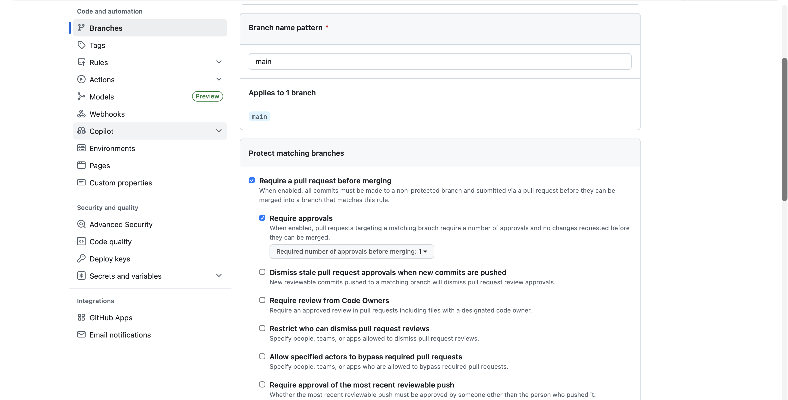
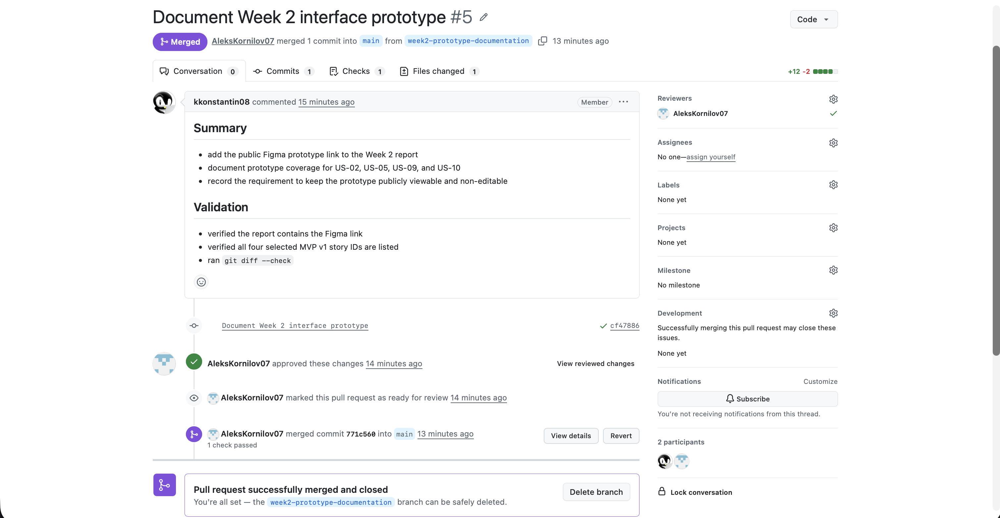
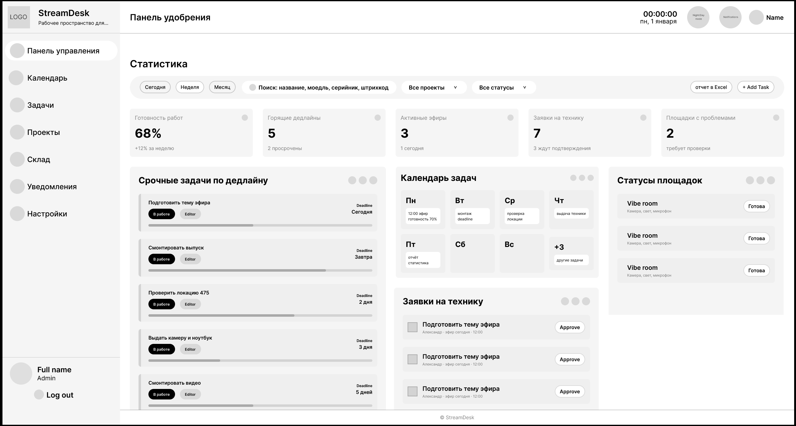
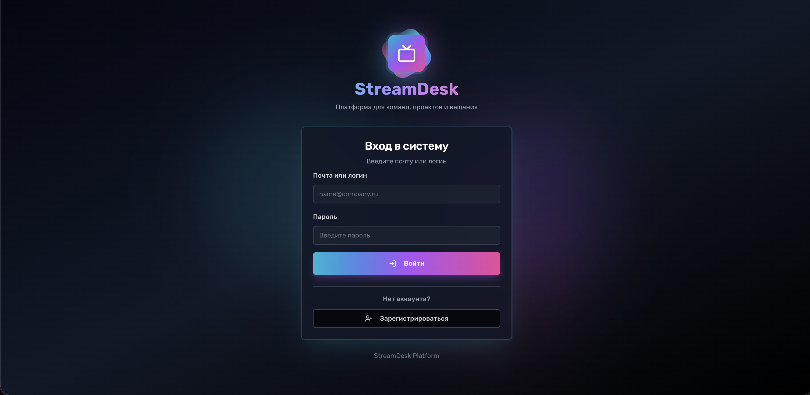

# StreamDesk: Week 2

StreamDesk is a production workflow management system for broadcast teams.

## Repository

- [Root README](../../README.md)
- [MIT License](../../LICENSE)
- [Pull request template](../../.github/pull_request_template.md)
- [Lychee configuration](../../lychee.toml)

## Week 2 Reports

- [User Stories](user-stories.md)
- [MVP v0 Report](mvp-v0-report.md)
- [Customer Meeting Summary](customer-meeting-summary.md)
- [Customer Meeting Transcript](customer-meeting-transcript.md)
- [Week Analysis](analysis.md)
- [LLM Usage Report](llm-report.md)

## Required Links

- Prototype: [StreamDesk interactive prototype (Figma)](https://www.figma.com/proto/zUuBGPcI53VIh2qIOkv1OA/Research-board-SWP?node-id=4232-58&p=f&viewport=-268%2C275%2C0.14&t=bogVB4RV92UbpFQp-1&scaling=min-zoom&content-scaling=fixed&page-id=4161%3A2)
- MVP v0 deployment: [team34.ru](http://team34.ru)
- Run instructions: [Local setup (root README)](../../README.md#локальный-запуск)
- MVP v0 video: [MVP v0 demonstration (Yandex Disk)](https://disk.yandex.ru/i/h7QVL3-S5v-lFQ)
- Reviewed PR: [PR #1 — Fix Lychee configuration](https://github.com/swp-team-34/streamdesk/pull/1)
- Latest successful Lychee run: [Link Check run #27492807498](https://github.com/swp-team-34/streamdesk/actions/runs/27492807498)
- Customer transcript: [Customer Meeting Transcript](customer-meeting-transcript.md)
- Customer meeting summary: [Customer Meeting Summary](customer-meeting-summary.md)

## Screenshots

### Protected default branch

### Reviewed PR

### Prototype

### MVP v0

## Coverage

### Prototype coverage

The [Figma interactive prototype](https://www.figma.com/proto/zUuBGPcI53VIh2qIOkv1OA/Research-board-SWP?node-id=4232-58&p=f&viewport=-268%2C275%2C0.14&t=bogVB4RV92UbpFQp-1&scaling=min-zoom&content-scaling=fixed&page-id=4161%3A2) covers the initial proposed MVP v1 scope:

- **US-02** — View tasks in a calendar: calendar screens with week, day, and month views are prototyped.
- **US-05** — Organize tasks on a dashboard: the task manager board with task cards and columns is prototyped.
- **US-09** — Show concise task details in calendar cells: calendar cells show task title, time, and status.
- **US-10** — Order dashboard tasks by deadline: dashboard layout groups tasks with deadline urgency visible.

The prototype also includes a warehouse screen relevant to **US-01** (Reserve equipment from storage), which is a Should Have story outside the MVP v1 scope.

### MVP v0 coverage

See [MVP v0 Report](mvp-v0-report.md) for the full description, deployment URL, and repeatable smoke-check scenario.

MVP v0 establishes the technical foundation relevant to the following stories:

- **US-02** — View tasks in a calendar: the calendar page is deployed and navigable.
- **US-05** — Organize tasks on a dashboard: the dashboard and task manager are accessible in the deployed application.
- **US-08** — View progress in real time: WebSocket infrastructure for real-time updates is present in the deployed backend.
- **US-10** — Order dashboard tasks by deadline: task ordering logic is part of the deployed task manager.

## Excluded Lychee links

The following URLs are excluded from automated Lychee link checking because GitHub Actions CI cannot reliably reach them (timeouts or network restrictions). Each was manually verified in a browser before submission and confirmed accessible.

| URL | Reason for exclusion |
| --- | --- |
| `https://streamdesk.innopolis.university/` | Times out from GitHub Actions; manually verified accessible |
| `https://streamdesk.ru/` | Times out from GitHub Actions; manually verified accessible |
| `http://team34.ru/` | MVP v0 deployment responds inconsistently from CI; manually verified accessible |
