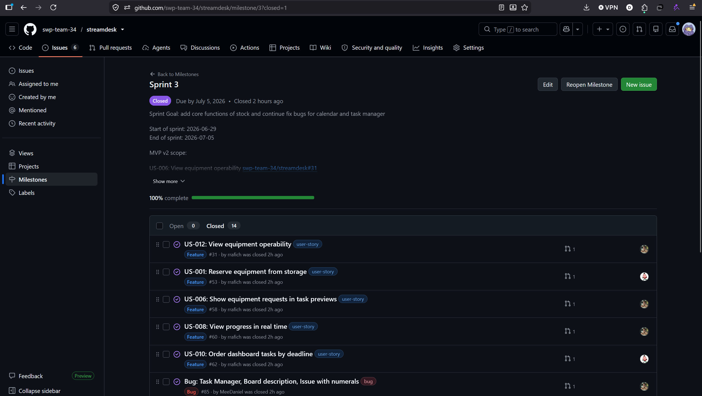
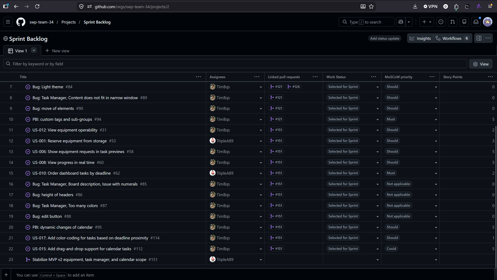
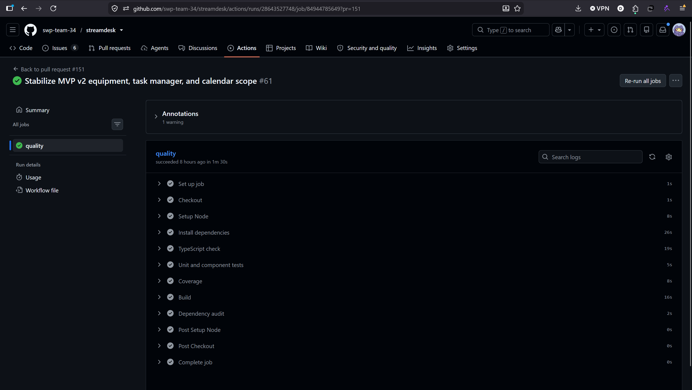
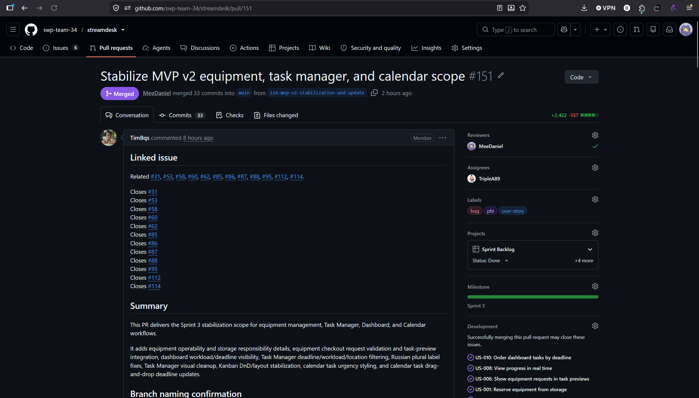
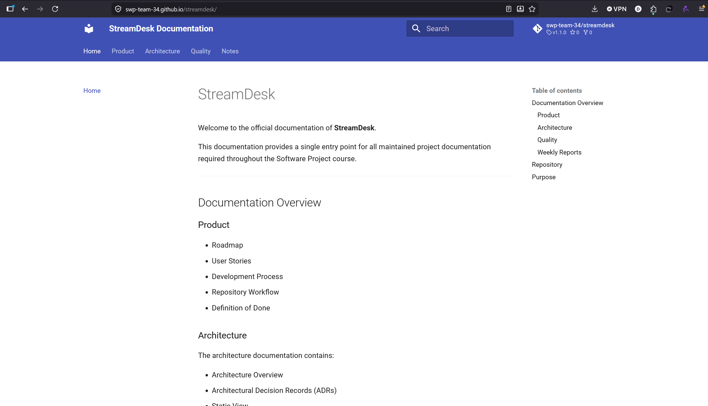

# Week 5 Report

## Project and Sprint Overview
1. **Project name and short description**:
   - **Name**: StreamDesk
   - **Short description**: StreamDesk is a production workflow management system for broadcast teams.
2. **Product Backlog board/view:** [Link](https://github.com/orgs/swp-team-34/projects/1)
3. **Sprint Backlog board/view:** [Link](https://github.com/orgs/swp-team-34/projects/2)
4. **Sprint 3 milestone:** [Link](https://github.com/swp-team-34/streamdesk/milestone/3)
5. **Sprint Goal, dates, and scope summary:**
   - **Goal**: Developers shall implement stock core functions and continue fix bugs for the task manager and calendar
   - **Dates** June 29, 2026 - July 5, 2026
   - **Scope summary**: Implement stock and fix bugs in task manager and calendar
6. **Total Sprint size:** 31 Story Points
7. **Summary of delivered `MVP v2` changes:**
   - Added operability status for equipment.
   - Added location/responsible/contact fields of the equipment.
   - Applications for equipment delivery have been added.
   - Added validation of applications by status and required fields.
   - The applications of the equipment are shown in the task preview.
   - Added dashboard widgets for progress and deadlines.
   - Added sorting of tasks by deadline.
   - Added workload and location filters to Task Manager.
   - Fixed Russian plural endings.
   - - The gray tones of the Task Manager have been simplified.
   - The Kanban DnD and speaker layout have been stabilized.
   - Fixed margins and footer task modal.
   - Added urgency color-coding for task-like calendar entries.
   - Added drag-and-drop Calendar for task deadlines.
8. **Deployed product / artifact:** [Link](https://team34.ru/)
9.  **Access or run instructions:** Enter any email and password for registration, then click "for personal use"

## Customer Feedback
10. **Customer feedback response table:**
    Extract some points from the customer feedback and link PBI
    | Feedback point | Resulting PBI or issue | Status | Response |
    |---|---|---|---|
    | Task Manager card action buttons overlap on smaller screens or high card density. | [#154](https://github.com/swp-team-34/streamdesk/issues/154) | Backlog | Added to backlog for responsive design improvements in Task Manager UI. |
    | Task Manager mobile view needs optimization (one card per screen, menu repositioning). | [#155](https://github.com/swp-team-34/streamdesk/issues/155) | Backlog | Added to backlog for future mobile UI/UX refinement. |
    | Warehouse: "Send to project" button UI glitch (flew off). | [#156](https://github.com/swp-team-34/streamdesk/issues/156) | Backlog | Added to backlog as a UI bug fix. |
    | Warehouse: Tasks failing to attach to checkout requests. | [#157](https://github.com/swp-team-34/streamdesk/issues/157) | Backlog | Added to backlog as a critical functional bug to investigate and fix. |
    | Warehouse: Minor quantity/count discrepancy in equipment list. | [#158](https://github.com/swp-team-34/streamdesk/issues/158) | Backlog | Added to backlog to investigate and fix inventory count logic. |
    | Dashboard: Implement drag-and-drop interactivity for widgets. | [#159](https://github.com/swp-team-34/streamdesk/issues/159) | Backlog | Deferred to the next sprint; current sprint focused on adding statistics widgets. |
    | Database: Ensure safe deployments to existing databases without data loss. | [#160](https://github.com/swp-team-34/streamdesk/issues/160) | Backlog | Added to backlog to implement proper database migration workflows. |
11.   **Explanation of feedback not addressed:** All customer feedback points received during the review have been addressed.

## Documentation and Quality
12. **Roadmap:** [Link](https://github.com/swp-team-34/streamdesk/blob/main/docs/roadmap.md)
13. **Definition of Done:** [Link](https://github.com/swp-team-34/streamdesk/blob/main/docs/definition-of-done.md)
14. **Testing:** [Link](https://github.com/swp-team-34/streamdesk/blob/main/docs/testing.md)
15. **Quality Requirements:** [Link](https://github.com/swp-team-34/streamdesk/blob/main/docs/quality-requirements.md)
16. **Quality Requirement Tests:** [Link](https://github.com/swp-team-34/streamdesk/blob/main/docs/quality-requirement-tests.md)
17. **Testing:** [Link](https://github.com/swp-team-34/streamdesk/blob/main/docs/testing.md)
18. **User Acceptance Tests:** [Link](https://github.com/swp-team-34/streamdesk/blob/main/docs/user-acceptance-tests.md)
19. **Architecture README:** [Link](https://github.com/swp-team-34/streamdesk/blob/main/docs/architecture/README.md)
20. **Static, Dynamic, and Deployment View Artifacts:**
    - **Static View**: [Link](https://github.com/swp-team-34/streamdesk/blob/main/docs/architecture/static-view/)
    - **Dynamic View**: [Link](https://github.com/swp-team-34/streamdesk/blob/main/docs/architecture/dynamic-view/)
    - **Deployment View**: [Link](https://github.com/swp-team-34/streamdesk/blob/main/docs/architecture/deployment-view/)
21. **ADR Directory:** [Link](https://github.com/swp-team-34/streamdesk/blob/main/docs/architecture/adr/)

## Architecture
22. **Architecture Summary:**
    - StreamDesk is a TypeScript monorepo featuring a React client, an Express server, and a PostgreSQL database.
    - The system is deployed on a single VPS with Nginx and PM2 to ensure simple and cost-effective MVP hosting.
    - The data layer uses Drizzle ORM with runtime schema guards to maintain type safety and flexible schema evolution.
    - A WebSocket gateway provides realtime updates and React Query invalidation for tasks, calendar events, and equipment.
23. **QR relations with architecture:**
    - ADR-001 ensures Equipment Permission Correctness (QR-01) by centralizing client-side evaluation while enforcing route-local server checks.
    - ADR-002 guarantees Protected Route Access Control (QR-02) by using a declarative wrapper to block unauthorized access and prompt for login.
    - ADR-003 enforces Automated Regression Coverage (QR-03) by unifying test execution and coverage reporting across the monorepo in CI.
24. **Testing and CI status summary:** All CI quality gates pass on the protected `main` branch for MVP v2.
    | Check | Status | Evidence |
    |---|---|---|
    | TypeScript check (`npm run check`) | Passing | [Quality run](https://github.com/swp-team-34/streamdesk/actions/runs/28548554181) |
    | Unit + component tests (`npm test`) | Passing (13 tests) | [Quality run](https://github.com/swp-team-34/streamdesk/actions/runs/28548554181) |
    | Coverage (`npm run coverage`) | Passing | [Quality run](https://github.com/swp-team-34/streamdesk/actions/runs/28548554181) |
    | Build (`npm run build`) | Passing | [Quality run](https://github.com/swp-team-34/streamdesk/actions/runs/28548554181) |
    | Dependency audit (`npm audit --audit-level=critical`) | Passing | [Quality run](https://github.com/swp-team-34/streamdesk/actions/runs/28548554181) |
    | Lychee link check | Passing | [Link Check run](https://github.com/swp-team-34/streamdesk/actions/runs/28548554209) |
    | QRT-001..QRT-004 | Passing | [Quality run](https://github.com/swp-team-34/streamdesk/actions/runs/28548554181) |

    - **Critical module coverage** (required ≥ 30%):
      - `equipment-permissions.ts` — 100%
      - `protected-route.tsx` — 73.33%
      - `task-dates.ts` — 55.71%

## CI and Automation
25. **CI pipeline:** [Link](https://github.com/swp-team-34/streamdesk/blob/main/.github/workflows/quality.yml)
26. **Latest protected-default-branch CI run:** [Link](https://github.com/swp-team-34/streamdesk/actions/runs/28643527748/job/84944785649?pr=151)

## Release and Demo
27. **SemVer release:** [Link](https://example.com) TODO: @TimBqs @aitovaskar
28. **CHANGELOG.md:** [Link](https://github.com/swp-team-34/streamdesk/blob/main/CHANGELOG.md)
29. **Public sanitized demo video:** [Link](https://disk.yandex.ru/i/l8QNbtsvjXRFag)

## Customer Review and documentation website
30. **Public sanitized UAT results summary**:
    - Active UAT scenarios were executed by the customer during a recorded session:
    - **UAT-005 (Warehouse Navigation and Filtering):** Passed. The customer successfully navigated to the Warehouse via the hamburger menu and applied filters (storage location, equipment status). They reacted positively to the system preventing the issuance of broken equipment (*"Ah, got it, cool feature"*). A minor count discrepancy was noted and logged as a bug.
    - **UAT-006 (Task Manager Date Validation and Sorting):** Passed. The customer tested date validations (preventing negative deadlines) and verified that overdue tasks correctly sort to the top. They provided constructive feedback regarding overlapping action buttons on cards at high densities and suggested mobile UI improvements.
    - **UAT-007 (Task Manager Participant Filtering):** Passed. The customer successfully applied the assignee filter to group tasks by participant and confirmed the logic worked as expected.
    - **UAT-008 (Calendar Drag-and-Drop and Views):** Passed. The customer tested drag-and-drop functionality across different views (3 days, month). Overdue tasks correctly displayed in red. Invalid drag-and-drop actions correctly triggered an error state without breaking the UI. The customer approved the overall convenience and usability (*"Yeah, it's convenient, everything is fine"*).
    - All feedback points have been converted into traceable PBIs and added to the Product Backlog (see Customer Feedback section above).
31. **Documentation website:** [Link](https://swp-team-34.github.io/streamdesk/)
32. **Customer review transcript:** [Link](https://github.com/swp-team-34/streamdesk/blob/main/reports/week5/sprint-review-transcript.md)
33. **Differs from the expected default:** No artifacts, evidence patterns, or access arrangements differ from the expected default.
34. **Review summary:** [Link](https://github.com/swp-team-34/streamdesk/blob/main/reports/week5/sprint-review-summary.md)

## Reflection and Reports
35. **Reflection:** [Link](https://github.com/swp-team-34/streamdesk/blob/main/reports/week5/reflection.md)
36. **Retrospective:** [Link](https://github.com/swp-team-34/streamdesk/blob/main/reports/week5/retrospective.md)
37. **LLM report:** [Link](https://github.com/swp-team-34/streamdesk/blob/main/reports/week5/llm-report.md)

## Status and Next Steps
38.  **Current product status:**
     - **Implemented**: Task manager, Calendar, Stock (partially)
     - **Not implemented**: Some features of stock, dashboard, "projects" page.
39.  **Next steps:** Next sprint we will focus on dashboard and unimplemented stock features

## Team Contribution
1.  **Contribution traceability table:**

    | Team Member | Issues Crated | PRs/MRs | Review Activity | Testing / Quality / Automation | Documentation |
    |---|---|---|---|---|---|
    | Aleksander Kornilov | [#128](https://github.com/swp-team-34/streamdesk/issues/128), [#132](https://github.com/swp-team-34/streamdesk/issues/132), [#136](https://github.com/swp-team-34/streamdesk/issues/136), [#137](https://github.com/swp-team-34/streamdesk/issues/137), [#138](https://github.com/swp-team-34/streamdesk/issues/138), [#140](https://github.com/swp-team-34/streamdesk/issues/140), [#141](https://github.com/swp-team-34/streamdesk/issues/141), [#150](https://github.com/swp-team-34/streamdesk/issues/150) | [#130](https://github.com/swp-team-34/streamdesk/pull/130), [#133](https://github.com/swp-team-34/streamdesk/pull/133), [#148](https://github.com/swp-team-34/streamdesk/pull/148), [#149](https://github.com/swp-team-34/streamdesk/pull/149), [#152](https://github.com/swp-team-34/streamdesk/pull/152) | [#131](https://github.com/swp-team-34/streamdesk/pull/131), [#135](https://github.com/swp-team-34/streamdesk/pull/135) | - | [customer-feedback-RT.md](customer-feedback-RT), [development-process](../../docs/development-process.md), [retrospective](retrospective.md), [llm-report](llm-report.md) |
    | Daniil Chernykh | [#129](https://github.com/swp-team-34/streamdesk/issues/129), [#134](https://github.com/swp-team-34/streamdesk/issues/134), [#136](https://github.com/swp-team-34/streamdesk/issues/136) | [#131](https://github.com/swp-team-34/streamdesk/pull/131), [#135](https://github.com/swp-team-34/streamdesk/pull/135), [#139](https://github.com/swp-team-34/streamdesk/pull/139), [#142](https://github.com/swp-team-34/streamdesk/pull/142) | [#130](https://github.com/swp-team-34/streamdesk/pull/130), [#144](https://github.com/swp-team-34/streamdesk/pull/144), [#148](https://github.com/swp-team-34/streamdesk/pull/148), [#149](https://github.com/swp-team-34/streamdesk/pull/149), [#151](https://github.com/swp-team-34/streamdesk/pull/151), [#152](https://github.com/swp-team-34/streamdesk/pull/152) | - | [roadmap](../../docs/roadmap.md), [architecture](../../docs/architecture/), `README.md` (this file), Moodle report pdf document |
    | Konstantin Kutashov | [#143](https://github.com/swp-team-34/streamdesk/issues/143) | [#144](https://github.com/swp-team-34/streamdesk/pull/144) | [#133](https://github.com/swp-team-34/streamdesk/pull/133), [#142](https://github.com/swp-team-34/streamdesk/pull/142) | Responsible for all tests, but they were done already | [definiton-of-done](../../docs/definition-of-done.md), [quality-requirement-tests](../../docs/quality-requirement-tests.md), [quality-requirements](../../docs/quality-requirements.md), [testing](../../docs/testing.md) |
    | Timofey Borschakov and Askar Aitov (all commits were done from Timofey's account due to problems with Askar's PC. Askar participated as well as Timofey) | - | [#151](https://github.com/swp-team-34/streamdesk/pull/151) (This PR closes the following issues: [#31](https://github.com/swp-team-34/streamdesk/issues/31), [#53](https://github.com/swp-team-34/streamdesk/issues/53), [#58](https://github.com/swp-team-34/streamdesk/issues/58), [#60](https://github.com/swp-team-34/streamdesk/issues/60), [#62](https://github.com/swp-team-34/streamdesk/issues/62), [#85](https://github.com/swp-team-34/streamdesk/issues/85), [#86](https://github.com/swp-team-34/streamdesk/issues/86), [#87](https://github.com/swp-team-34/streamdesk/issues/87), [#88](https://github.com/swp-team-34/streamdesk/issues/88), [#95](https://github.com/swp-team-34/streamdesk/issues/95), [#112](https://github.com/swp-team-34/streamdesk/issues/112), [#114](https://github.com/swp-team-34/streamdesk/issues/114)) | - | - | - |
    | Rafael Zainullin | [#145](https://github.com/swp-team-34/streamdesk/issues/145) | [#146](https://github.com/swp-team-34/streamdesk/pull/146) | - | - | - |

## Evidence Screenshots
41. **Embedded screenshots from `reports/week4/images/`:**
    - Sprint milestone: 
    - Board or project workflow view: 
    - Latest protected-default-branch CI run: 
    - SemVer release: `, [Release2](images/next-part.png)` TODO: @kk0sta
    - Example reviewed issue-linked PR/MR: 
    - Hosted docs site: 