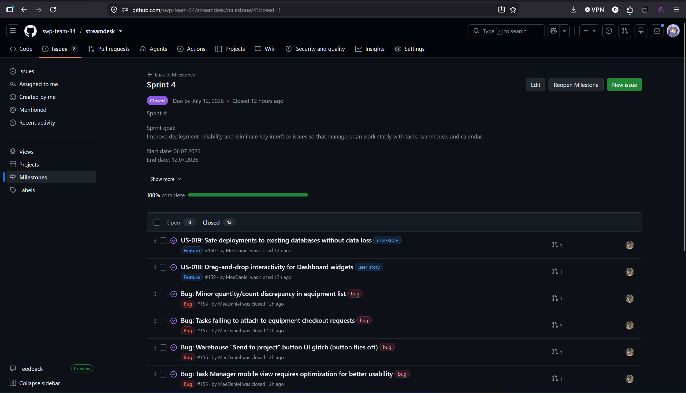
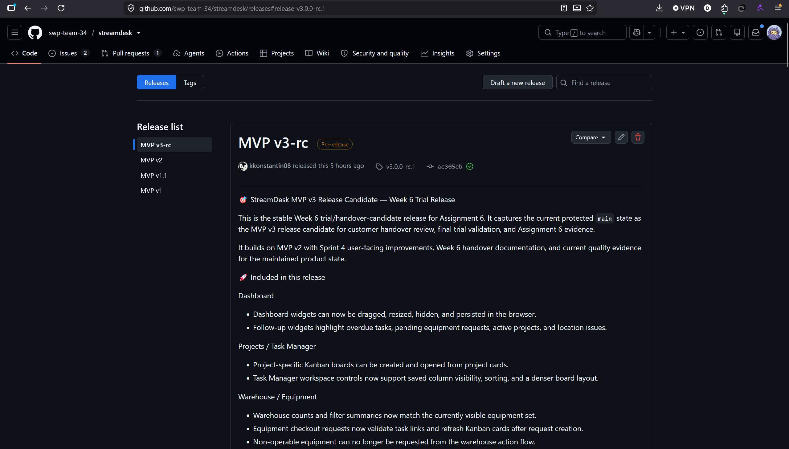
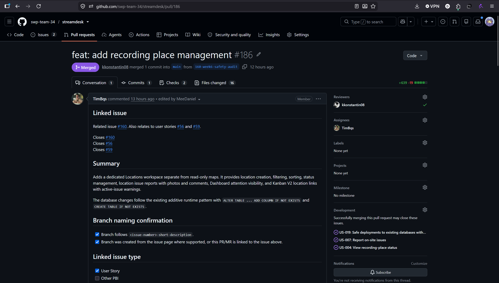

# Week 6 Report

## Project and Sprint Overview
1. **Project name and short description:**
   - **Name**: StreamDesk
   - **Short description**: StreamDesk is a production workflow management system for broadcast teams.
2. **Product Backlog board/view:** [Link](https://github.com/orgs/swp-team-34/projects/1)
3. **Sprint 4 Backlog board/view:** [Link](https://github.com/orgs/swp-team-34/projects/2)
4. **Sprint 4 milestone:** [Link](https://github.com/swp-team-34/streamdesk/milestone/4)
5. **Sprint 4 Goal, dates, and scope summary:**
   - **Goal**: Improve deployment reliability and eliminate key interface issues so that managers can work stably with tasks, warehouse, and calendar
   - **Dates**: July 6, 2026 - July 12, 2026
   - **Scope summary**: All features modifiation. Completing the product and pre-final verification
6. **Total Sprint 4 size:** 18 Story Points
7. **Summary of Week 6 trial-release changes:**
   - [US-020 #175](https://github.com/swp-team-34/streamdesk/issues/175): separate Kanban project boards, synchronization of participants, linking cards and statistics with the project.
   - [Bug #157](https://github.com/swp-team-34/streamdesk/issues/157): Equipment requests are linked to the Kanban card or legacy task.
   - [Bug #156](https://github.com/swp-team-34/streamdesk/issues/156): fixed the layout of the "Send to project" button.
   - [Bug #158](https://github.com/swp-team-34/streamdesk/issues/158): hardware counters match the filtered list.
   - [US-021 #176](https://github.com/swp-team-34/streamdesk/issues/176) / Bug #155: Sorting, compact Task Manager, simplified List view and mobile controls.
   - [US-018 #159](https://github.com/swp-team-34/streamdesk/issues/159): Move, resize, hide, and save Dashboard widgets.
   - [US-016 #113](https://github.com/swp-team-34/streamdesk/issues/113) / Bug #111: Fixed overlap and overflow of Calendar tasks, saved drag/resize.
   - [US-019 #160](https://github.com/swp-team-34/streamdesk/issues/160): Secure additive runtime updates to existing databases.
   - [US-004 #56](https://github.com/swp-team-34/streamdesk/issues/56): separate site tab, creation, filtering, sorting and statuses.
   - [US-007 #59](https://github.com/swp-team-34/streamdesk/issues/59): Site errors, comments, photos, Dashboard widget and warning in Kanban V2.
8. **Week 6 product access artifact:** [Link](https://team34.ru/)
9.  **Current access or run instructions:** Enter any email and password for registration, then click "for personal use"

## Documentation and Handover
10. **README.md:** [Link](https://github.com/swp-team-34/streamdesk/README.md)
11. **CONTRIBUTING.md:** [Link](https://github.com/swp-team-34/streamdesk/CONTRIBUTING.md)
12. **AGENTS.md:** [Link](https://github.com/swp-team-34/streamdesk/AGENTS.md)
13. **Customer handover documentation:** [Link](https://github.com/swp-team-34/streamdesk/blob/main/docs/customer-handover.md)
14. **Hosted documentation site:** [Link](https://swp-team-34.github.io/streamdesk/)
15. **Customer-facing documentation review summary:**
    - Customer opened the repository documentation during the meeting and said it was familiar and fine.
    - Clear: repository entry point and handover documents.
    - Unclear or missing: no specific documentation gaps were named.
16. **Transition-readiness summary and Week 7 needs:**
    - Customer independently used the Week 6 trial release.
    - Current use is demonstration/testing only; it is not deployed on the customer side.
    - Customer said the product can be used after Week 7 fixes and deployment.
    - Week 7 needs: Warehouse categories/subcategories, kit-component safeguards, Locations improvements, UI polish, deployment documentation, and handover support.

## Customer Feedback and Trial Results
17. **Customer feedback response table:**

    | Feedback point | Resulting PBI or issue | Status | Response |
    |---|---|---|---|
    | User-configurable Warehouse categories/subcategories | Sprint 5 follow-up PBI | Open | Planned for Week 7 |
    | Prevent issuing active kit components separately; log removals | Sprint 5 follow-up PBI | Open | Planned for Week 7 |
    | Expand Locations into venue archive with notes, files, history, and issue workflow | Sprint 5 follow-up PBI | Open | Planned for Week 7 |
    | Link Warehouse requests to tasks as well as projects | Follow-up PBI | Open | Backlog / Week 7 if capacity allows |
    | Add task responsible person and initiator fields | Follow-up PBI | Open | Backlog |
    | Add comments/photos to equipment items | Follow-up PBI | Open | Backlog |
    | Add hints for custom-field filters | Follow-up PBI | Open | Backlog |
    | Add Dashboard reset-to-default layout action | Follow-up PBI | Deferred | Customer marked it as nice-to-have |

18. **Explanation of feedback not yet addressed:**
    - Feedback was collected during the Week 6 trial and remains open before Sprint 5.
    - Week 7 priority is Warehouse taxonomy, kit safeguards, Locations improvements, deployment, and handover.
    - Dashboard reset, task ownership metadata, request-to-task linking, equipment comments/photos, and filter hints remain backlog unless selected for Sprint 5.
19. **Roadmap:** [Link](https://github.com/swp-team-34/streamdesk/blob/main/docs/roadmap.md)
20. **Maintained quality, testing, architecture, development-process, and customer-relevant documentation:**
    - **Quality requirements:** [Link](https://github.com/swp-team-34/streamdesk/docs/quality-requirements.md)
    - **Quality requirement tests:** [Link](https://github.com/swp-team-34/streamdesk/docs/quality-requirement-tests.md)
    - **Architecture:** [Link](https://github.com/swp-team-34/streamdesk/docs/architecture/README.md)
    - **Development process:** [Link](https://github.com/swp-team-34/streamdesk/docs/development-process.md)
    - **Testing:** [Link](https://github.com/swp-team-34/streamdesk/docs/testing.md)
    - **User acceptance tests:** [Link](https://github.com/swp-team-34/streamdesk/user-acceptance-tests.md)
    - **User stories**: [Link](https://github.com/swp-team-34/streamdesk/docs/user-stories.md)
21. **Relevant UAT or customer-trial results summary:**
    - Overall result: passed with observations.
    - Dashboard customization passed; customer requested reset-to-default layout.
    - Task Manager, projects, boards, labels, custom fields, comments, attachments, movement, and statistics passed with observations.
    - Calendar overdue display passed.
    - Locations passed; customer requested archive/history/comments workflow.
    - Warehouse filters, kits, QR code, cart, ownership, and status flows passed with observations.

## Release and Review Evidence
22. **Week 6 SemVer trial release:** [Link](https://github.com/swp-team-34/streamdesk/releases#release-v3.0.0-rc.1)
23. **CHANGELOG.md:** [Link](https://github.com/swp-team-34/streamdesk/blob/main/CHANGELOG.md)
24. **Sprint Review transcript:** [Link](https://github.com/swp-team-34/streamdesk/blob/main/reports/week6/sprint-review-transcript.md)
25. **Sprint Review summary:** [Link](https://github.com/swp-team-34/streamdesk/blob/main/reports/week6/sprint-review-summary.md)
26. **Reflection:** [Link](https://github.com/swp-team-34/streamdesk/blob/main/reports/week6/reflection.md)
27. **Retrospective:** [Link](https://github.com/swp-team-34/streamdesk/blob/main/reports/week6/retrospective.md)
28. **LLM report:** [Link](https://github.com/swp-team-34/streamdesk/blob/main/reports/week6/llm-report.md)

## Status and Next Steps
29. **Current product status and expected Week 7 follow-up work:**
    - Status: Week 6 trial release is usable for customer testing. Dashboard, Calendar, Task Manager, project Kanban boards, Warehouse basics, Locations basics, and safe database updates were improved.
    - Customer readiness: customer can start using StreamDesk after Week 7 fixes and deployment.
    - Week 7 priority: Warehouse categories/subcategories, kit-component safeguards, Locations editing and issue workflow, linked task/card/stream selection for errors, field-level validation, issue status metadata, UI for closing/canceling errors, legacy-task warnings, and automated US-019 PostgreSQL verification.
    - Handover needs: deployment documentation, final access arrangement, and transition support.

## Team Contribution
30.  **Contribution traceability table:**

| Team Member | Issues | PRs/MRs | Review Activity | Testing / Quality / Automation | Documentation | Transition / Deployment |
|---|---|---|---|---|---|---|
| AleksKornilov07 | - | [#188](https://github.com/swp-team-34/streamdesk/pull/188) | [#167](https://github.com/swp-team-34/streamdesk/pull/167), [#190](https://github.com/swp-team-34/streamdesk/pull/190) | - | [#187](https://github.com/swp-team-34/streamdesk/issues/187) | - |
| MeeDaniel | [#155](https://github.com/swp-team-34/streamdesk/issues/155), [#156](https://github.com/swp-team-34/streamdesk/issues/156), [#157](https://github.com/swp-team-34/streamdesk/issues/157), [#158](https://github.com/swp-team-34/streamdesk/issues/158), [#159](https://github.com/swp-team-34/streamdesk/issues/159), [#160](https://github.com/swp-team-34/streamdesk/issues/160) | [#135](https://github.com/swp-team-34/streamdesk/pull/135), [#142](https://github.com/swp-team-34/streamdesk/pull/142), [#153](https://github.com/swp-team-34/streamdesk/pull/153), [#163](https://github.com/swp-team-34/streamdesk/pull/163), [#165](https://github.com/swp-team-34/streamdesk/pull/165), [#167](https://github.com/swp-team-34/streamdesk/pull/167), [#168](https://github.com/swp-team-34/streamdesk/pull/168), [#190](https://github.com/swp-team-34/streamdesk/pull/190) | [#188](https://github.com/swp-team-34/streamdesk/pull/188) | - | [#166](https://github.com/swp-team-34/streamdesk/issues/166), [#169](https://github.com/swp-team-34/streamdesk/issues/169), [#178](https://github.com/swp-team-34/streamdesk/issues/178), [#189](https://github.com/swp-team-34/streamdesk/issues/189) | - |
| TimBqs | [#56](https://github.com/swp-team-34/streamdesk/issues/56), [#59](https://github.com/swp-team-34/streamdesk/issues/59), [#111](https://github.com/swp-team-34/streamdesk/issues/111), [#113](https://github.com/swp-team-34/streamdesk/issues/113), [#155](https://github.com/swp-team-34/streamdesk/issues/155), [#156](https://github.com/swp-team-34/streamdesk/issues/156), [#157](https://github.com/swp-team-34/streamdesk/issues/157), [#158](https://github.com/swp-team-34/streamdesk/issues/158), [#159](https://github.com/swp-team-34/streamdesk/issues/159), [#160](https://github.com/swp-team-34/streamdesk/issues/160), [#175](https://github.com/swp-team-34/streamdesk/issues/175), [#176](https://github.com/swp-team-34/streamdesk/issues/176) | [#177](https://github.com/swp-team-34/streamdesk/pull/177), [#179](https://github.com/swp-team-34/streamdesk/pull/179), [#180](https://github.com/swp-team-34/streamdesk/pull/180), [#181](https://github.com/swp-team-34/streamdesk/pull/181), [#182](https://github.com/swp-team-34/streamdesk/pull/182), [#184](https://github.com/swp-team-34/streamdesk/pull/184), [#186](https://github.com/swp-team-34/streamdesk/pull/186) | [#172](https://github.com/swp-team-34/streamdesk/pull/172), [#185](https://github.com/swp-team-34/streamdesk/pull/185), [#193](https://github.com/swp-team-34/streamdesk/pull/193) | - | - | - |
| TripleA89 | - | [#174](https://github.com/swp-team-34/streamdesk/pull/174) | - | - | - | [#173](https://github.com/swp-team-34/streamdesk/issues/173) |
| kkonstantin08 | - | [#171](https://github.com/swp-team-34/streamdesk/pull/171), [#172](https://github.com/swp-team-34/streamdesk/pull/172), [#193](https://github.com/swp-team-34/streamdesk/pull/193) | [#174](https://github.com/swp-team-34/streamdesk/pull/174), [#177](https://github.com/swp-team-34/streamdesk/pull/177), [#179](https://github.com/swp-team-34/streamdesk/pull/179), [#180](https://github.com/swp-team-34/streamdesk/pull/180), [#181](https://github.com/swp-team-34/streamdesk/pull/181), [#182](https://github.com/swp-team-34/streamdesk/pull/182), [#184](https://github.com/swp-team-34/streamdesk/pull/184), [#186](https://github.com/swp-team-34/streamdesk/pull/186) | - | [#170](https://github.com/swp-team-34/streamdesk/issues/170), [#192](https://github.com/swp-team-34/streamdesk/issues/192) | - |
| rrafich | [#56](https://github.com/swp-team-34/streamdesk/issues/56), [#59](https://github.com/swp-team-34/streamdesk/issues/59), [#111](https://github.com/swp-team-34/streamdesk/issues/111), [#113](https://github.com/swp-team-34/streamdesk/issues/113) | [#146](https://github.com/swp-team-34/streamdesk/pull/146), [#185](https://github.com/swp-team-34/streamdesk/pull/185) | - | - | [#183](https://github.com/swp-team-34/streamdesk/issues/183) | - |

## Evidence Screenshots
31.  **Embedded screenshots from `reports/week6/images/`:**

     - Sprint milestone: 
     - Week 6 release: 
     - Example reviewed issue-linked PR/MR: 
