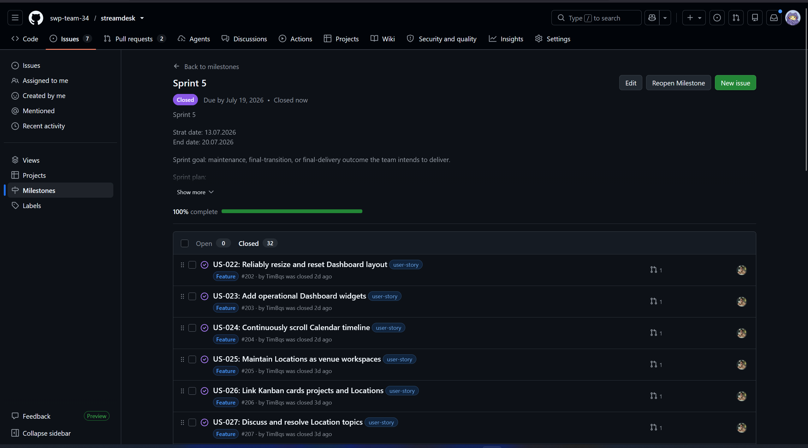
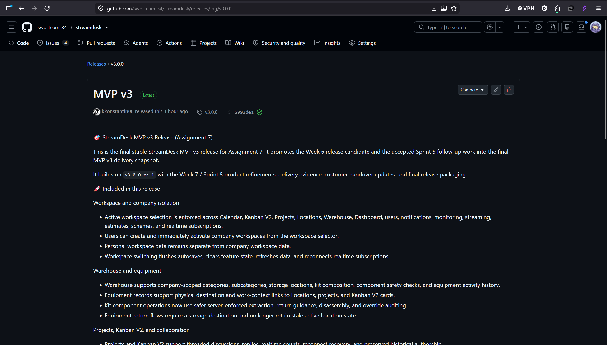
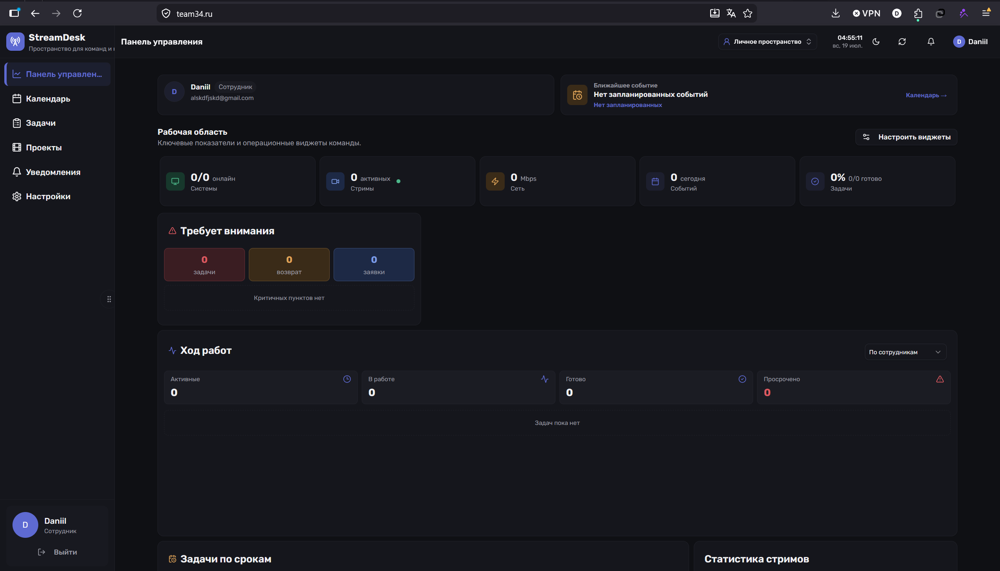
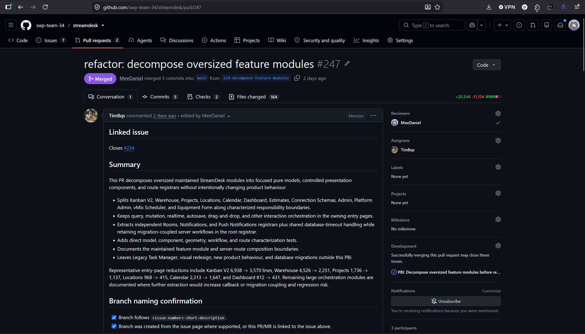
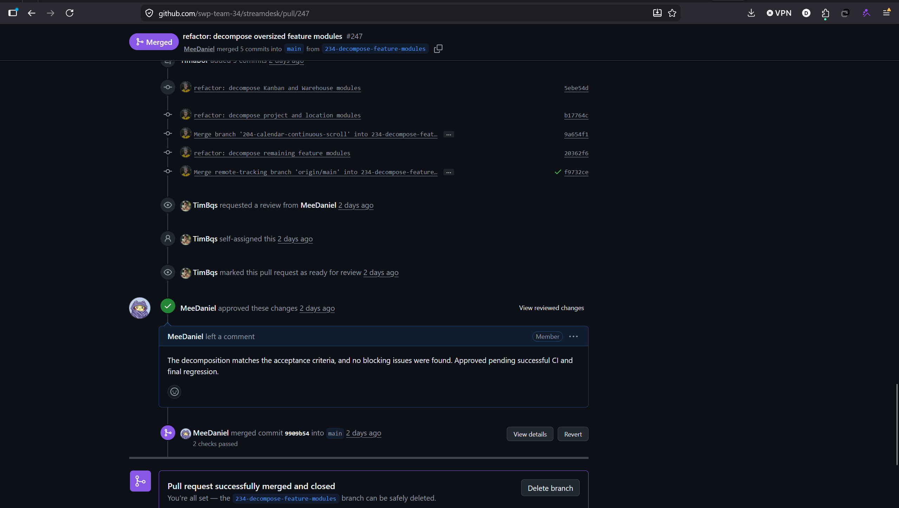

# Week 7 Report

## Project and Sprint Overview
1. **Link to Week 6 Report:** [reports/week6/README.md](../week6/README.md)
2. **Product Backlog board/view:** [Link](https://github.com/orgs/swp-team-34/projects/1)
3. **Sprint 5 Backlog board/view:** [Link](https://github.com/orgs/swp-team-34/projects/2)
4. **Sprint 5 milestone:** [Sprint 5](https://github.com/swp-team-34/streamdesk/milestone/5)
5. **Sprint 5 Goal, dates, and scope summary:**
   - **Goal**: Refine the product and deliver the work to the customer.
   - **Dates**: July 13, 2026 - July 19, 2026
   - **Scope summary**: Completing final tasks elicitated from the customer during the sprint 4 review.
6. **Total Sprint 5 size:** 130 Story Points
7. **Summary of Week 7 follow-up maintenance and final MVP v3 changes:**
   - **Architecture & Workspace**: Decomposed modules, unified UI, enforced data isolation, and supported multiple company workspaces.
   - **Warehouse & Kanban**: Configured storage locations/categories, kits composition, threaded comments, smart text input, and project statistics.
   - **Locations, Calendar & Dashboard**: Maintained venue workspaces, continuous timeline scrolling, and fixed widget layout bugs.
8. **Final product access artifact:** [Link](https://team34.ru/)
9.  **Current access or run instructions:** Enter any email and password for registration, then click "for personal use" or join a company workspace.

## Documentation and Final Handover
10. **README.md:** [Link](https://github.com/swp-team-34/streamdesk/blob/main/README.md)
11. **CONTRIBUTING.md:** [Link](https://github.com/swp-team-34/streamdesk/blob/main/CONTRIBUTING.md)
12. **AGENTS.md:** [Link](https://github.com/swp-team-34/streamdesk/blob/main/AGENTS.md)
13. **Customer handover documentation:** [Link](https://github.com/swp-team-34/streamdesk/blob/main/docs/customer-handover.md)
14. **Hosted documentation site:** [Link](https://swp-team-34.github.io/streamdesk/)
15. **Final transition outcome summary:**
    - **Handover Level Reached:** Ready for independent use
    - **Customer-Confirmation Status:** Accepted
16. **Summary of transferred/delegated items:**
    - Transferred access instructions, testing environments (`team34.ru`), and comprehensive handover documentation (`docs/customer-handover.md`).
17. **Remaining transition blockers, limitations, and follow-up items:**
    - Deployment on a customer-owned VPS is pending.
    - Final `MVP v3` SemVer release packaging is pending.
    - Calendar progressive buffering requires validation under sustained fast scrolling.
18. **Customer-independent use / deployment evidence:**
    - The customer independently used the Week 6 trial build. The latest Sprint 5 follow-up build is verified and accessible on the test instance `team34.ru`.

## Customer Feedback and UAT Results
19. **Customer feedback response table for Sprint 5 follow-up work:**

    | Feedback point | Resulting PBI or issue | Status | Response |
    |---|---|---|---|
    | The current result is a strong working tool and can already be taken into work for tasks, projects, and warehouse operations. | Follow-up PBI | Resolved | The team successfully met the MVP v3 goals and prepared the product for handover. |
    | The product unifies workflows typically split across separate systems (Bitrix, Trello, 1C, Excel). | Follow-up PBI | Resolved | Acknowledged during the review. |
    | High delivery speed: built a full-fledged service in about five weeks. | Follow-up PBI | Resolved | Acknowledged during the review. |
    | Question about how to take an item that is part of a kit. | [#219](https://github.com/swp-team-34/streamdesk/issues/219) | Resolved | Demonstrated that components must be removed from the kit first to ensure integrity. |
    | Need to deploy the product on customer servers. | Follow-up PBI | Open | The team will support the customer-side team during integration and deployment. |
    | Need to test Warehouse workflows and scanning in the deployed environment. | Follow-up PBI | Open | Additional feedback will be collected after full practical testing by the customer. |

20. **Relevant Week 7 UAT or customer-trial results summary:**
    - Scenarios UAT-006 through UAT-016 (testing new Warehouse logic, Locations, Workspace isolation, and UI features) were executed and marked as Passed.
## Release, Demo, and Review Evidence
21. **Final SemVer release (MVP v3):** [Link](https://github.com/swp-team-34/streamdesk/releases/tag/v3.0.0)
22. **CHANGELOG.md:** [Link](https://github.com/swp-team-34/streamdesk/blob/main/CHANGELOG.md)
23. **Public sanitized demo video:** [Link](https://disk.yandex.ru/i/bk_02S8cY8zV4g)
24. **Demo Day preparation summary:**
    - The required Week 7 rehearsal preparation was completed. All team members are prepared to present and participate in Demo Day.
    - TODO: @TripleA89
25. **Sprint Review transcript/notes:** [Link](sprint-review-transcript.md)
26. **Sprint Review summary:** [Link](sprint-review-summary.md)
27. **Reflection:** [Link](reflection.md)
28. **Retrospective:** [Link](retrospective.md)
29. **LLM report:** [Link](llm-report.md)

## Status and Team Contribution
30. **Final product status:**
    - All requirements has been satisfied
    - All tools were developed
    - The product is ready to handover
    - Follow-up plan exists
31. **Contribution traceability table:**

| Team Member | Issues | PRs/MRs | Review Activity | Testing / Quality / Automation | Documentation | Transition / Deployment / Demo Day |
|---|---|---|---|---|---|---|
| @AleksKornilov07 | - | [#262](https://github.com/swp-team-34/streamdesk/pull/262) | - | - | [#225](https://github.com/swp-team-34/streamdesk/issues/225) | - |
| @MeeDaniel | - | [#263](https://github.com/swp-team-34/streamdesk/pull/263), [#264](https://github.com/swp-team-34/streamdesk/pull/264) | [#247](https://github.com/swp-team-34/streamdesk/pull/247), [#260](https://github.com/swp-team-34/streamdesk/pull/260) | - | [#248](https://github.com/swp-team-34/streamdesk/issues/248), [#265](https://github.com/swp-team-34/streamdesk/issues/265) | - |
| @TimBqs | [#202](https://github.com/swp-team-34/streamdesk/issues/202), [#203](https://github.com/swp-team-34/streamdesk/issues/203), [#204](https://github.com/swp-team-34/streamdesk/issues/204), [#205](https://github.com/swp-team-34/streamdesk/issues/205), [#206](https://github.com/swp-team-34/streamdesk/issues/206), [#207](https://github.com/swp-team-34/streamdesk/issues/207), [#208](https://github.com/swp-team-34/streamdesk/issues/208), [#209](https://github.com/swp-team-34/streamdesk/issues/209), [#210](https://github.com/swp-team-34/streamdesk/issues/210), [#211](https://github.com/swp-team-34/streamdesk/issues/211), [#212](https://github.com/swp-team-34/streamdesk/issues/212), [#213](https://github.com/swp-team-34/streamdesk/issues/213), [#214](https://github.com/swp-team-34/streamdesk/issues/214), [#215](https://github.com/swp-team-34/streamdesk/issues/215), [#216](https://github.com/swp-team-34/streamdesk/issues/216), [#217](https://github.com/swp-team-34/streamdesk/issues/217), [#218](https://github.com/swp-team-34/streamdesk/issues/218), [#219](https://github.com/swp-team-34/streamdesk/issues/219), [#220](https://github.com/swp-team-34/streamdesk/issues/220), [#221](https://github.com/swp-team-34/streamdesk/issues/221), [#222](https://github.com/swp-team-34/streamdesk/issues/222), [#223](https://github.com/swp-team-34/streamdesk/issues/223), [#230](https://github.com/swp-team-34/streamdesk/issues/230), [#231](https://github.com/swp-team-34/streamdesk/issues/231), [#232](https://github.com/swp-team-34/streamdesk/issues/232), [#233](https://github.com/swp-team-34/streamdesk/issues/233), [#234](https://github.com/swp-team-34/streamdesk/issues/234), [#238](https://github.com/swp-team-34/streamdesk/issues/238), [#250](https://github.com/swp-team-34/streamdesk/issues/250), [#251](https://github.com/swp-team-34/streamdesk/issues/251), [#252](https://github.com/swp-team-34/streamdesk/issues/252), [#253](https://github.com/swp-team-34/streamdesk/issues/253), [#254](https://github.com/swp-team-34/streamdesk/issues/254), [#255](https://github.com/swp-team-34/streamdesk/issues/255), [#256](https://github.com/swp-team-34/streamdesk/issues/256) | [#224](https://github.com/swp-team-34/streamdesk/pull/224), [#226](https://github.com/swp-team-34/streamdesk/pull/226), [#227](https://github.com/swp-team-34/streamdesk/pull/227), [#228](https://github.com/swp-team-34/streamdesk/pull/228), [#229](https://github.com/swp-team-34/streamdesk/pull/229), [#235](https://github.com/swp-team-34/streamdesk/pull/235), [#236](https://github.com/swp-team-34/streamdesk/pull/236), [#237](https://github.com/swp-team-34/streamdesk/pull/237), [#239](https://github.com/swp-team-34/streamdesk/pull/239), [#240](https://github.com/swp-team-34/streamdesk/pull/240), [#241](https://github.com/swp-team-34/streamdesk/pull/241), [#242](https://github.com/swp-team-34/streamdesk/pull/242), [#243](https://github.com/swp-team-34/streamdesk/pull/243), [#244](https://github.com/swp-team-34/streamdesk/pull/244), [#247](https://github.com/swp-team-34/streamdesk/pull/247), [#249](https://github.com/swp-team-34/streamdesk/pull/249), [#258](https://github.com/swp-team-34/streamdesk/pull/258), [#260](https://github.com/swp-team-34/streamdesk/pull/260), [#261](https://github.com/swp-team-34/streamdesk/pull/261) | [#246](https://github.com/swp-team-34/streamdesk/pull/246), [#262](https://github.com/swp-team-34/streamdesk/pull/262) | - | [#257](https://github.com/swp-team-34/streamdesk/issues/257), [#259](https://github.com/swp-team-34/streamdesk/issues/259) | - |
| @kkonstantin08 | - | - | [#224](https://github.com/swp-team-34/streamdesk/pull/224), [#226](https://github.com/swp-team-34/streamdesk/pull/226), [#227](https://github.com/swp-team-34/streamdesk/pull/227), [#228](https://github.com/swp-team-34/streamdesk/pull/228), [#229](https://github.com/swp-team-34/streamdesk/pull/229), [#235](https://github.com/swp-team-34/streamdesk/pull/235), [#236](https://github.com/swp-team-34/streamdesk/pull/236), [#237](https://github.com/swp-team-34/streamdesk/pull/237), [#239](https://github.com/swp-team-34/streamdesk/pull/239), [#240](https://github.com/swp-team-34/streamdesk/pull/240), [#241](https://github.com/swp-team-34/streamdesk/pull/241), [#242](https://github.com/swp-team-34/streamdesk/pull/242), [#243](https://github.com/swp-team-34/streamdesk/pull/243), [#244](https://github.com/swp-team-34/streamdesk/pull/244), [#249](https://github.com/swp-team-34/streamdesk/pull/249), [#258](https://github.com/swp-team-34/streamdesk/pull/258) | - | - | Polishing slide about Testing |
| @rrafich | [#245](https://github.com/swp-team-34/streamdesk/issues/245) | [#185](https://github.com/swp-team-34/streamdesk/pull/185), [#246](https://github.com/swp-team-34/streamdesk/pull/246) | - | - | - | - |
| @TripleA89 | - | - | - | - | - | Work on presentation |

## Evidence Screenshots
32. **Embedded screenshots from `reports/week7/images/`:**

    - Sprint 5 milestone: 
    - Final release: 
    - Final product access/deployment evidence: 
    - Example reviewed issue-linked PR/MR:  
